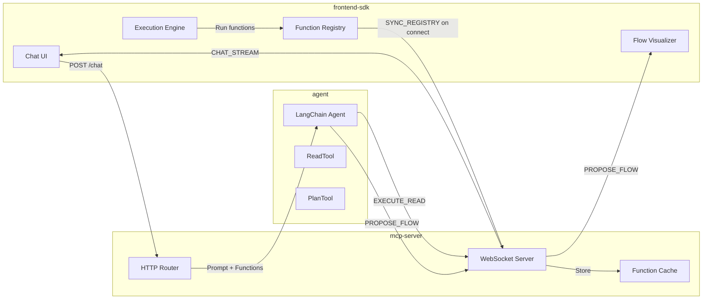
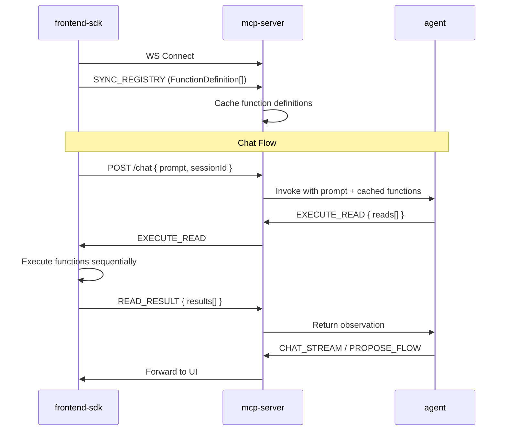

# HackerAgent Monorepo Implementation Plan

## Architecture Overview




## Connection & Registry Sync Flow




## 1. Scaffold Monorepo

Create root structure with pnpm workspace configuration:

- `pnpm-workspace.yaml` - Define packages glob
- `package.json` - Root scripts for workspace management
- `tsconfig.base.json` - Shared TypeScript config
- `.gitignore` - Standard ignores for node_modules, dist, etc.
- `packages/` directory with three subfolders

## 2. Package: mcp-server

**Location:** `packages/mcp-server/`

**Dependencies:** `bun`, `ws`, `zod`

**Key Files:**

- `src/index.ts` - Entry point, starts server on port 4000
- `src/websocket.ts` - WebSocket connection handler, processes SYNC_REGISTRY
- `src/router.ts` - HTTP router (POST /chat), passes cached functions to agent
- `src/schemas.ts` - Zod schemas for message validation
- `src/types.ts` - Shared message types (EXECUTE_READ, PROPOSE_FLOW, CHAT_STREAM, SYNC_REGISTRY)
- `src/sessionStore.ts` - In-memory store for session state (function cache, pending requests)

**Message Protocol:**

```ts
// A single read operation within EXECUTE_READ
type ReadOperation = {
  id: string;           // Unique ID for this read step
  functionId: string;   // Which function to call
  arguments: object;    // Arguments for the function
};

// Server -> SDK events
type ServerEvent = 
  | { 
      type: "EXECUTE_READ"; 
      requestId: string;
      reads: ReadOperation[];  // Multiple sequential read calls
    }
  | { type: "PROPOSE_FLOW"; plan: FlowPlan }
  | { type: "CHAT_STREAM"; content: string; done: boolean };

// SDK -> Server events  
type ClientEvent =
  | { 
      type: "SYNC_REGISTRY"; 
      functions: FunctionDefinition[];  // Full registry sent on connect
    }
  | { 
      type: "READ_RESULT"; 
      requestId: string; 
      results: { id: string; result: any; error?: string }[];
    }
  | { type: "FLOW_RESULT"; planId: string; results: FlowNode[] };
```

**Function Registry Sync:**

- On WebSocket connect, SDK immediately sends `SYNC_REGISTRY` with all `FunctionDefinition[]`
- mcp-server caches these per connection/session
- When agent is invoked, it receives the function list as context (system prompt or tool metadata)
- If registry changes (user adds/edits functions), SDK sends updated `SYNC_REGISTRY`

## 3. Package: agent

**Location:** `packages/agent/`

**Dependencies:** `langchain`, `@langchain/anthropic`, `zod`

**Key Files:**

- `src/index.ts` - Entry point, initializes agent
- `src/agent.ts` - LangChain agent configuration with Claude
- `src/tools/readTool.ts` - ReadTool definition
- `src/tools/planTool.ts` - PlanTool definition
- `src/types.ts` - Tool input/output schemas

**Agent Initialization:**

- Receives `FunctionDefinition[]` from mcp-server when handling a chat request
- Builds dynamic system prompt listing available functions with their descriptions and parameters
- Functions are categorized as "read" (safe, immediate) or "write" (requires user approval via PlanTool)

**Tool Definitions:**

- **ReadTool**: Accepts one or more sequential read function calls. Sends EXECUTE_READ with array of reads to mcp-server, waits for all results, returns combined observation. Example input:
  ```ts
  {
    reads: [
      { functionId: "listClusters", arguments: {} },
      { functionId: "getClusterDetails", arguments: { id: "$0.clusters[0].id" } }
    ]
  }
  ```
  Supports result substitution: `$0` refers to first read's result, `$1` to second, etc.
- **PlanTool**: Creates a flow plan for write operations that require user approval. Sends PROPOSE_FLOW to mcp-server, returns "Plan sent to user for review"

## 4. Package: frontend-sdk

**Location:** `packages/frontend-sdk/`

**Dependencies:** `vite`, `react`, `react-dom`, `tailwindcss`

**Key Files:**

- `src/main.tsx` - SDK entry point, mounts overlay
- `src/components/SplitPane.tsx` - Main layout container
- `src/components/ChatPane.tsx` - Left pane chat interface
- `src/components/FlowPane.tsx` - Right pane flow visualizer
- `src/components/FlowNode.tsx` - Individual flow step component
- `src/registry/index.ts` - Function registry (localStorage CRUD)
- `src/runtime/executor.ts` - Execution engine using `new Function()`
- `src/hooks/useWebSocket.ts` - WebSocket connection hook
- `src/types.ts` - Shared types (FlowPlan, FlowNode, FunctionDefinition)
- `vite.config.ts` - Library mode configuration

**UI Structure:**

- Full-screen overlay with split pane layout
- Left: Chat bubbles (user/AI), message input
- Right: Flow visualizer with status indicators (pending/running/success/failed)
- Action bar: "Run Flow", "Edit Parameters", "Cancel"

## 5. Shared Types

Create shared type definitions used across packages:

```ts
type FunctionDefinition = {
  id: string;
  name: string;
  description: string;
  type: "read" | "write";  // read = safe/immediate, write = requires approval
  code: string;            // e.g. "return fetch('/api/v1/cluster/' + args.id)"
  parameters: { name: string; type: string; description?: string }[];
};

type FlowPlan = {
  planId: string;
  intent: string;
  nodes: FlowNode[];
};

type FlowNode = {
  id: string;
  functionId: string;
  title: string;
  arguments: Record<string, any>;
  status: "pending" | "running" | "success" | "failed";
  result?: any;
};
```

## 6. Mock Function Definitions (for Testing)

Pre-populate the registry with mock functions to test the system:

```ts
const mockFunctions: FunctionDefinition[] = [
  // READ functions (safe, immediate execution)
  {
    id: "listClusters",
    name: "List Clusters",
    description: "Get a list of all available clusters",
    type: "read",
    code: `return { clusters: [
      { id: "cluster-1", name: "Production", status: "running" },
      { id: "cluster-2", name: "Staging", status: "running" },
      { id: "cluster-3", name: "Development", status: "stopped" }
    ]}`,
    parameters: []
  },
  {
    id: "getClusterDetails",
    name: "Get Cluster Details",
    description: "Get detailed information about a specific cluster",
    type: "read",
    code: `return { 
      id: args.clusterId, 
      name: "Cluster " + args.clusterId,
      nodes: 3,
      cpu: "45%",
      memory: "62%",
      uptime: "14d 6h"
    }`,
    parameters: [{ name: "clusterId", type: "string", description: "The cluster ID" }]
  },
  {
    id: "getClusterLogs",
    name: "Get Cluster Logs",
    description: "Fetch recent logs from a cluster",
    type: "read",
    code: `return { logs: [
      "[INFO] Service started",
      "[INFO] Health check passed",
      "[WARN] High memory usage detected"
    ]}`,
    parameters: [{ name: "clusterId", type: "string" }]
  },
  
  // WRITE functions (require user approval)
  {
    id: "restartCluster",
    name: "Restart Cluster",
    description: "Restart a cluster (causes brief downtime)",
    type: "write",
    code: `console.log("Restarting cluster:", args.clusterId); return { success: true }`,
    parameters: [{ name: "clusterId", type: "string" }]
  },
  {
    id: "scaleCluster",
    name: "Scale Cluster",
    description: "Change the number of nodes in a cluster",
    type: "write",
    code: `console.log("Scaling", args.clusterId, "to", args.nodeCount, "nodes"); return { success: true }`,
    parameters: [
      { name: "clusterId", type: "string" },
      { name: "nodeCount", type: "number", description: "Target number of nodes" }
    ]
  },
  {
    id: "deleteCluster",
    name: "Delete Cluster",
    description: "Permanently delete a cluster and all its data",
    type: "write",
    code: `console.log("Deleting cluster:", args.clusterId); return { success: true, deleted: args.clusterId }`,
    parameters: [{ name: "clusterId", type: "string" }]
  }
];
```

These mocks will be loaded into localStorage on first SDK init if no registry exists.

## 7. Development Scripts

Root `package.json` scripts:

```json
{
  "scripts": {
    "dev:server": "pnpm --filter mcp-server run dev",
    "dev:agent": "pnpm --filter agent run dev",
    "dev:sdk": "pnpm --filter frontend-sdk run dev",
    "dev": "concurrently \"pnpm dev:server\" \"pnpm dev:agent\" \"pnpm dev:sdk\"",
    "build": "pnpm -r build"
  }
}
```

